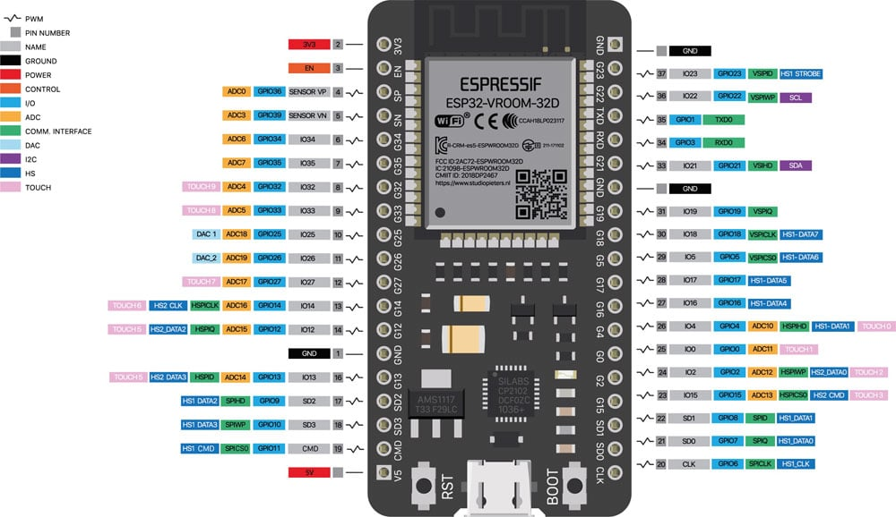

# Allarme Gas ESP32

Sistema di allarme gas per camper basato su ESP32, con display TFT touchscreen, sensori MQ-7 (CO) e MQ-135 (gas tossici), buzzer, memoria storica e interfaccia grafica LVGL.

---

## **Funzionalità**

- **Visualizzazione valori in tempo reale** di CO e gas tossici, sempre visibili sulla homepage.
- **Storico valori**: ultimi 10 minuti (aggiornamento ogni 10 secondi, 60 valori memorizzati in EEPROM interna).
- **Allarme**: buzzer + segnale visivo (schermo rosso, messaggio centrale) se superata soglia.
- **Preriscaldamento sensori**: all'avvio monitoraggio, attende 10 secondi prima del controllo soglie.
- **Menu opzioni**: modifica soglie, test allarme, storico.
- **Stato sistema**: icona verde lampeggiante in alto a destra se attivo.
- **Home page**: sempre visibili valori sensori, pulsanti AVVIO/STOP/OPZIONI.

---

## **Hardware consigliato**

| Componente            | Modello/Note                                     |
|---------------------- |--------------------------------------------------|
| MCU                   | ESP32 DevKit v1                                  |
| Display               | TFT touch SPI (es. ILI9341, 2.8"/3.2"/3.5")      |
| Touchscreen           | XPT2046 (SPI)                                    |
| Sensore CO            | MQ-7                                             |
| Sensore Gas Tossici   | MQ-135                                           |
| Buzzer                | 5V, attivo/passivo, pilotato da ESP32            |
| Alimentazione         | 5V (preferibilmente da DC/DC step-down)          |

---

## **Collegamenti hardware ESP32**

| Segnale             | ESP32 Pin | Modulo/Sensore            | Descrizione                                   |
|---------------------|-----------|---------------------------|-----------------------------------------------|
| T_IRQ               | GPIO 36   | Touchscreen TFT           | Interrupt touch                              |
| T_OUT               | GPIO 39   | Touchscreen TFT           | Touch OUT (MISO)                             |
| T_DIN               | GPIO 32   | Touchscreen TFT           | Touch DIN (MOSI)                             |
| T_CS                | GPIO 33   | Touchscreen TFT           | Touch Chip Select                            |
| T_CLK               | GPIO 25   | Touchscreen TFT           | Touch Clock                                  |
| SDO (MISO)          | GPIO 12   | Display TFT               | Dati dal display (MISO)                      |
| GUIDATO             | GPIO 21   | Display TFT               | General Purpose (di solito non usato)        |
| SCK                 | GPIO 14   | Display TFT               | Clock SPI display                            |
| SDI (MOSI)          | GPIO 13   | Display TFT               | Dati verso display (MOSI)                    |
| D/C                 | GPIO 2    | Display TFT               | Data/Command display                         |
| RESET               | IT/RESET  | Display TFT               | Reset display (collega a RESET o GPIO)       |
| Servizio clienti    | GPIO 15   | Display TFT               | Chip Select display (CS)                     |
| Terra               | GND       | Tutti moduli              | Massa comune                                 |
| VCC                 | 5V/3.3V   | Tutti moduli              | Alimentazione positiva (preferibilmente 5V*) |
| MQ-7                | GPIO 34   | Sensore CO                | Segnale analogico monossido di carbonio      |
| MQ-135              | GPIO 35   | Sensore Gas Tossici       | Segnale analogico gas tossici                |
| Buzzer              | GPIO 27   | Buzzer                    | Segnale digitale per allarme acustico        |

**Nota:**  
I pin sono quelli suggeriti nel software. Modifica se il tuo display/touchscreen usa altri pin.
Collega i sensori MQ-7 e MQ-135 ai pin analogici ESP32. Alimenta i sensori sempre a 5V.

---

## **Schema pinout ESP32**

> Salva l’immagine pinout come `doc/pinout_esp32.png` nella root del progetto.

---

## **Installazione librerie Arduino consigliate**

- **LVGL**: interfaccia grafica
- **TFT_eSPI**: driver display
- **XPT2046_Touchscreen**: driver touch
- **EEPROM**: salvataggio dati storico

---

## **Funzionamento software**

1. **All'avvio**: visualizza i valori sensori in tempo reale sulla home page.
2. **AVVIO**: parte il preriscaldamento (10s), poi il sistema entra in monitoraggio attivo (icona verde lampeggiante in alto a destra).
3. **STOP**: sistema fermo, buzzer spento, nessun allarme.
4. **Allarme**: se CO o gas tossici superano soglia, attiva buzzer e schermo rosso, messaggio centrale.
5. **Storico**: accessibile dal menu, mostra min/max/media degli ultimi 10 valori (auto-refresh ogni 10s).
6. **Modifica soglie**: da menu opzioni, modifica soglie CO e tossici, salvate in EEPROM.
7. **Test allarme**: da menu opzioni, attiva buzzer per 2 secondi.

---

## **Configurazione e personalizzazione**

- **Soglie**: impostabili da menu (default 400 per entrambi).
- **Aggiornamento storico**: ogni 10 secondi (modificabile).
- **Numero valori storico**: 60 (10 min), modificabile cambiando `STORICO_SIZE` nel codice.
- **Pin hardware**: modificabili nelle define all'inizio del file `.ino`.

---

## **Sicurezza e avvertenze**

- I sensori MQ vanno alimentati correttamente (riscaldatore sempre acceso).
- Preriscaldamento necessario per letture affidabili.
- Non affidarti solo a questi sensori per la sicurezza personale!  
  Usali come complemento a dispositivi certificati.

---

## **File principale**
Salva il file principale del programma come:

**`allarmegas_esp32.ino`**

---

## **Autore**
- fabiuz73 (GitHub)

---

## **Licenza**
MIT (modificabile secondo necessità del progetto)

---

## **Suggerimenti**

- Per progetti camper, usa sempre sensori gas certificati come sistema primario.
- Il software è pensato per test, didattica e supporto/backup.
